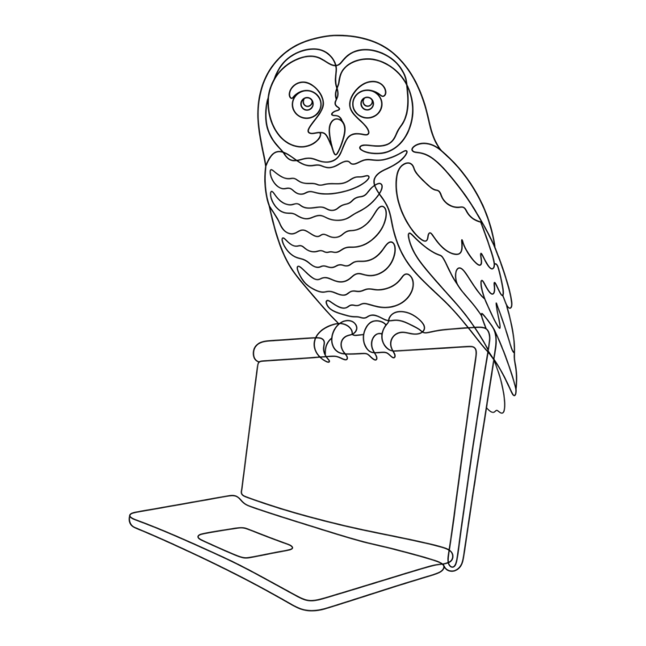
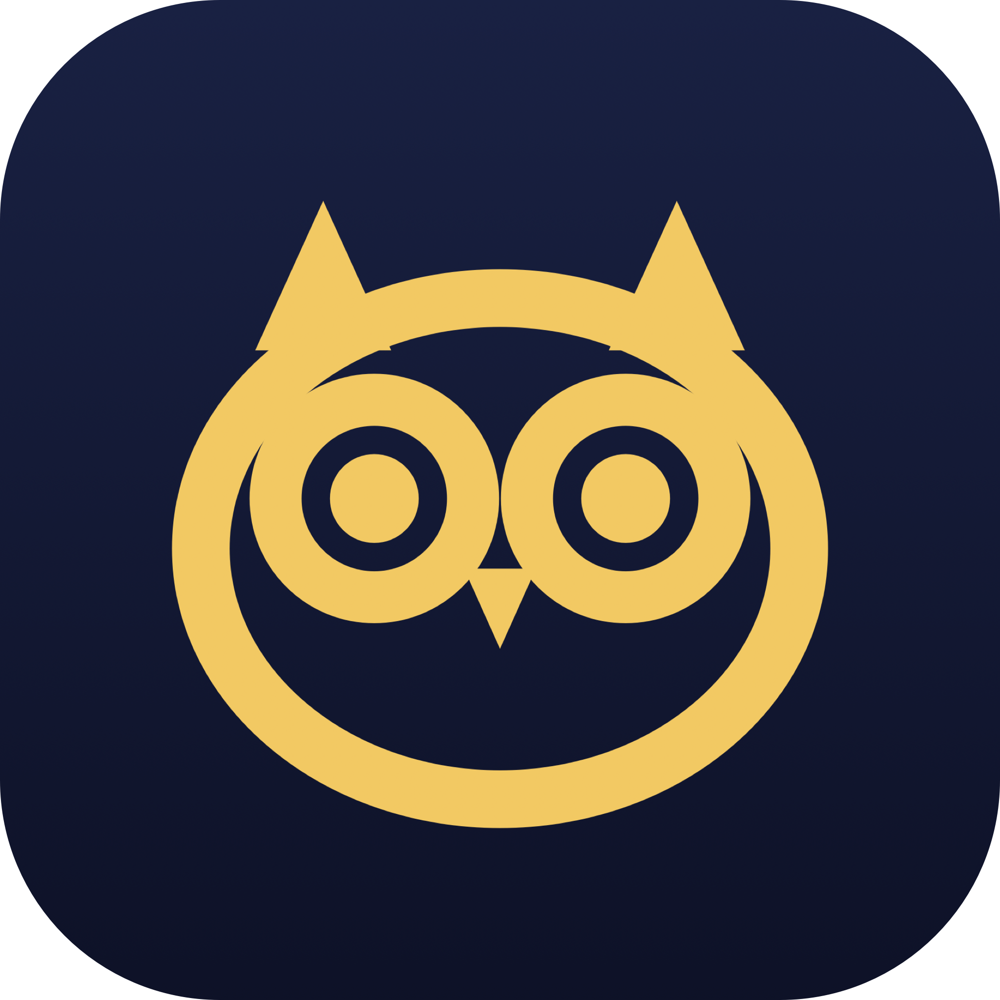

<p align="center">
  <picture>
    <source media="(prefers-color-scheme: dark)" srcset="docs/assets/logo-dark.png">
    
  </picture>
</p>

<p align="center">
  
</p>

<h1 align="center">Barred Awake 🦉</h1>

A tiny macOS **menu bar** app that keeps your Mac awake. Named after the
barred owl, its eyes are **shut when off** and **wide open when on**.


## Features

Click the owl in the menu bar for two toggles:

- **Keep Awake (even with lid shut)** prevents idle sleep via an
  `IOPMAssertion`, *and* runs `pmset disablesleep 1` so the Mac stays awake
  even when you close the lid (clamshell). The lid-shut part needs admin
  rights, so macOS will prompt for your password the first time you enable it.
- **Start on Boot** registers the app as a login item using
  `SMAppService` (macOS 13+).

The owl's eyes are **shut** while sleeping normally and snap **wide open**
while keeping the Mac awake. The preference is remembered across launches,
and the clamshell override is dropped automatically on quit.

## Build & run

```sh
./build.sh
open "build/Barred Awake.app"
```

Requires macOS 13+ and a Swift toolchain (Xcode or Command Line Tools).
The build script compiles with SwiftPM, assembles a `LSUIElement` (menu-bar
only, no Dock icon) app bundle, and ad-hoc code-signs it so login-item
registration works locally.

## Notes

- Keeping a Mac awake with the lid shut on battery can run it hot. That's
  inherent to defeating clamshell sleep, not a bug.
- "Start on Boot" may need a one-time approval in
  **System Settings → General → Login Items**.

## Project layout

```
Sources/BarredAwake/
  main.swift        # AppDelegate, status item, menu, login-item toggle
  OwlIcon.swift     # draws the template owl (eyes shut vs. wide open)
  SleepGuard.swift  # IOPMAssertion + pmset disablesleep
build.sh            # compile + bundle into Barred Awake.app
```
